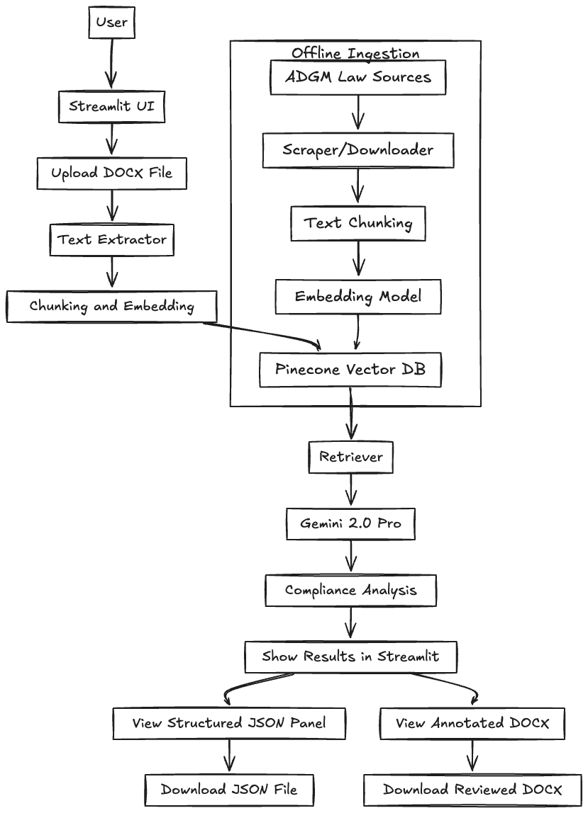

 ADGM Compliance Assistant

ADGM Compliance Assistant is a Retrieval-Augmented Generation (RAG) powered Streamlit app that checks corporate documents for compliance against ADGM requirements.  
It allows users to upload `.docx` files, analyzes them with Gemini 2.0 , retrieves relevant law sections from a Pinecone vector database, and outputs structured compliance reports with missing documents, issues, and downloadable results.

Features
- **Streamlit Web UI** – Simple upload & analyze interface
- **RAG Pipeline** – Uses Pinecone as vector store and Gemini for reasoning
- **DOCX Upload** – Accepts corporate documents for analysis
- **Compliance Scoring** – Calculates score based on required documents
- **Issue Detection** – Highlights missing or incomplete sections
- **Downloadable Results** – JSON compliance summary and reviewed DOCX

 Architecture Overview

Setup Instructions

1. Clone Repository
git clone 
cd adgm-compliance-assistant

2. Create Virtual Environment
python3 -m venv .venv
source .venv/bin/activate

3. Install Dependencies
pip install -r requirements.txt

4. Environment Variables
Create a .env file in the project root:
GEMINI_API_KEY=your_gemini_key_here
PINECONE_API_KEY=your_pinecone_key_here
PINECONE_ENVIRONMENT=gcp-starter
PINECONE_INDEX=adgm-compliance

5. Run the App
streamlit run app.py
Example Documents
Before Review
/examples/license_application_before.docx
A sample corporate document missing required ADGM sections.

After Review
/examples/license_application_after_review.docx
Same document with annotations and compliance suggestions.

Generated Structured Output
Example JSON file generated after document review:

json
{
  "process": "Company Licensing",
  "documents_uploaded": 5,
  "required_documents": 7,
  "missing_documents": [
    "Shareholder Register",
    "Articles of Association"
  ],
  "compliance_score": 50,
  "issues_found": [
    {
      "document": "License Application Form",
      "section": "Unspecified",
      "issue": "Missing information on the form may cause delays.",
      "severity": "Medium"
    }
  ]
}

<video width="600" controls>
  <source src="assets/demo.mp4" type="video/mp4">
  Your browser does not support the video tag.
</video>

